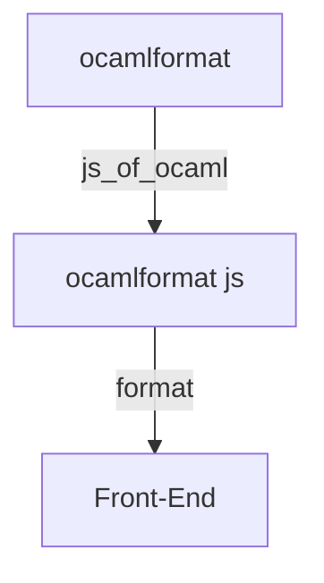

OCaml 在開發初期時，會需要反覆的調整 ocamlformat 設定檔直到符合自己的風格，但整個過程是乏味且痛苦的，你要反覆對照參數，有時甚至搞不懂參作用是什麼，改一下試一下非常浪費時間，當時就想說如果有個像 Prettier 那樣的線上編輯器那該有多好。

我搜索了一下還真有，基本是利用 Js_of_ocaml 把 ocamlformat 編成 js，一些畫面也是用 OCaml 寫成，不過作者似乎是沒更新了，既然有先例，那我肯定能照著他的想法復刻一個，但我這次想把 UI 介面用我熟悉的方式寫成，畢竟我好歹也是個前端工程師，ocamlformat 部分只綁定一個 format 函數給前端用。

最終這個想法是能動的，不過在 `vite run dev` 的情況下載入那份 ocaml 生成的 JS 會報錯，目前找不到原因，編譯倒是能編譯。

過程中我也從 ocamlformat 原始碼中看到一些我沒看過的寫法，挺有趣的，之後可以來研究看看。

- [Github](https://github.com/FizzyElt/ocamlformat-online-editor)
- [Demo](https://ocamlformat-online-editor.pages.dev/)