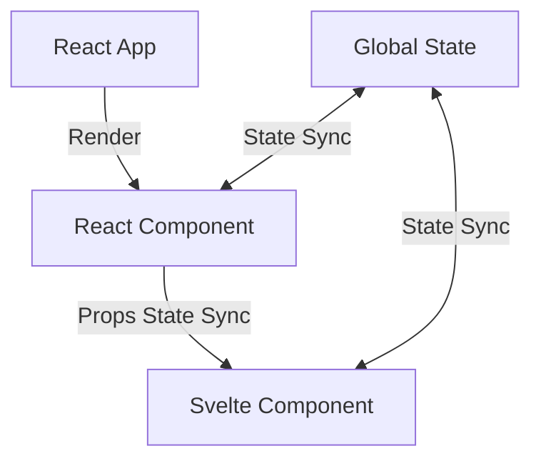

前端多框架融合本身一直都是可能的，當然一般情況下肯定是不建議的，畢竟多一個框架就多一份維護成本。但有時候在特定情境下，我們不得不這麼做。

- 部分元件想透過特定框架優點已達到更好的效能
- 專案框架遷移不想被迫全部一次重新寫，而是逐步替換

## 多框架共存

在前端 bundler tool 功能越來越強的今天，本身就能處理各式各樣的檔案，尤其是不同框架有自己的模版語法，這時候 bundler tool 就會把這些檔案轉譯成 JavaScript，所以最終還是可以操作這些轉譯後的元件。

但轉譯歸轉譯，我們想要是融合這些框架，而不是完全各自做自己的事，並且同時能共享狀態。這次我以 React 為主要框架，並在其中嵌入 Svelte 元件為例，但嵌入前要先考量幾個問題。

- 樣式不一致
- 全域狀態同步
- props 狀態同步



### 樣式不一致

這相較於狀態比較沒有什麼難點，如果本身使用 shadcn, tailwindcss, pandacss 等本身就不完全依附於框架的 UI library，設定檔可以共享，這樣成本就只會花在重建元件上，如果不是就會花更多時間寫樣式，因此這個問題單純就是時間成本的問題。

### 全域狀態同步

畢竟是嵌入，有時還是需要取全域狀態使用，這時得看一下框架有提供什麼與外部對接的方法，像 React 就是 `useExternalStore`，Svelte 則是 `store` 內提供的方法。

### props 狀態同步

除了單純對接把 component 渲染出來之外，還需要 props 狀態同步，也就是說當 React 傳給 Svelte 的 props 改變時，Svelte 也要跟著更新。

## Svelte 嵌入 React

我們需要做一個對接層，把 Svelte 元件封装成 React component，這樣 React 才能使用它，不過要先把 Svelte 拉回現實世界渲染出來，不然是沒辦法使用的，這裡用 `mount` 方法渲染在 React 節點上。大部分框架都會有這個的方法，像 React 就是 `createRoot(target).render(<App />)`。

```tsx
import { memo, useLayoutEffect, useRef } from "react";
import { type Component, mount } from "svelte";

export const createSvelteComponent = <Props extends Record<string, any>>(
  component: Component<Props>,
) => {
  function SvComponent(props: Props) {
    const ref = useRef<HTMLDivElement>(null);

    useLayoutEffect(() => {
      while (ref.current?.firstChild) {
        ref.current.firstChild.remove();
      }

      if (ref.current) {
        mount(component, { target: ref.current, props });
      }
    }, []);

    return <div ref={ref}></div>;
  }

  SvComponent.displayName = component.name;

  return memo(SvComponent);
};
```

```tsx
import Demo from "./Demo.svelte";

const ReactDemo = createSvelteComponent(Demo);

export default ReactDemo;
```

## 共享全域狀態

我目前在 Svelte 內找到唯一能在外部建立狀態並且能讓 Svelte component 監聽的 API 是 [svelte/store](https://svelte.dev/docs/svelte/stores) 的 `writable`、`readable`，而 React 只要有辦法提供給 `userExternalStore` 監聽的 API 即可。而且就這麼剛好 `writable`、`readable` 本身就有提供 `subscribe` 方法，這樣就能讓 React 監聽。

將這個建立共享狀態的流程抽象成一個 function。

```ts
export const createShareValue = <T>(value: T) => {
  const writableValue = writable(value);
  const sub = (callback: Subscriber<T>) => {
    const unsub = writableValue.subscribe(callback);

    return unsub;
  };

  const getter = () => get(writableValue);

  const useStore = () => {
    const value = useSyncExternalStore(sub, getter);

    const set = useCallback((v: SetStateAction<T>) => {
      if (typeof v === "function") {
        return writableValue.update(v as Updater<T>);
      }

      return writableValue.set(v);
    }, []);

    return [value, set] as const;
  };

  return [writableValue, useStore] as const;
};

// create new share value
export const [countStore, useCount] = createShareValue(0);
```

Svelte 可以直接拿 `countStore` 來使用，也能做更新，所以不需要多做什麼

```svelte
<script lang="ts">
  import { countStore } from "./store"; 
</script>

<p>{$countStore}</p>
```

這樣就能同時在 React 與 Svelte 共享同個狀態並且誰都能觸發更新。

## props 狀態同步

對於第一個與 Svelte 元件對接的 React component 來說，props 狀態有個問題是只會取第一次 mount 的狀態，之後 React 的 props 改變都不會觸發 Svelte 更新。那這裡辦法就是把所有 props 都塞進 `useLayoutEffect` 的依賴陣列中，這樣每次 props 改變都會觸發 `useLayoutEffect`，然後重新 mount 一次 Svelte 元件。

```diff
import { memo, useLayoutEffect, useRef } from "react";
import { type Component, mount } from "svelte";

export const createSvelteComponent = <Props extends Record<string, any>>(
  component: Component<Props>,
) => {
  function SvComponent(props: Props) {
    const ref = useRef<HTMLDivElement>(null);

    useLayoutEffect(() => {
      while (ref.current?.firstChild) {
        ref.current.firstChild.remove();
      }

      if (ref.current) {
        mount(component, { target: ref.current, props });
      }
-   }, []);
+   }, Object.values(props));

    return <div ref={ref}></div>;
  }

  SvComponent.displayName = component.name;

  return memo(SvComponent);
};
```

不過這樣每次 props 改變都會重新 mount 一次 Svelte 元件，這樣會導致元件內部狀態被重置掉，而且所有節點會重新渲染，這並不夠好。

透過處理全域狀態的思路做變化可以解決這個問題，在 React 用 `useRef` 創建一個臨時的 `writable` 狀態，並且把 props 全部塞進去，這樣 Svelte 只要在 `$props` 監聽這個傳進來的狀態就能達到 props 狀態同步的效果，React 則是在更新這個 `writable` 的 ref，而不是強制重新 mount。

不過 Svelte component 的 props 結構上會需要多隔一層，而且為了配合 React 的單向資料流，在此刻意將 props ref 轉成 readonly 再帶入，這樣可以避免 Svelte component 直接從內部修改 props 資訊。

```tsx
import { memo, useLayoutEffect, useRef } from "react";
import { type Component, mount } from "svelte";
import { type Readable, readonly, type Writable, writable } from "svelte/store";

// 多隔一層讓 Svelte 能直接監聽 props 物件
type ReactSvProps<Props extends Record<string, any>> = {
  props: Readable<Props>;
};

export const createSvelteComponentStore = <Props extends Record<string, any>>(
  component: Component<ReactSvProps<Props>>,
) => {
  function SvComponent(props: Props) {
    const ref = useRef<HTMLDivElement>(null);
    const propsRef = useRef<Writable<Props> | null>(null);

    if (!propsRef.current) {
      propsRef.current = writable(props);
    }

    useLayoutEffect(() => {
      while (ref.current?.firstChild) {
        ref.current.firstChild.remove();
      }

      if (ref.current && propsRef.current) {
        mount(component, {
          target: ref.current,
          props: {
            props: readonly(propsRef.current),
          },
        });
      }
    }, []);

    useLayoutEffect(() => {
      propsRef.current?.set(props);
    }, [props]);

    return <div ref={ref}></div>;
  }

  SvComponent.displayName = component.name;

  return memo(SvComponent);
};
```

```svelte
<script lang="ts">
  import { type Readable } from "svelte/store";
  const { props: readonlyProps }: ReactSvProps<{ count: number }>  = $props();

  // 解構並監聽變化
  const { count } = $derive($readonlyProps);

</script>
```

這樣就能將在 React 中使用 Svelte component 與 React component 的運作思維保持一致，而不必多思考傳入的 props 是否只是第一次 mount 時才帶入。

## 不是接完結束了

我們從一開始到現在只是解決了最基本讓 React 與 Svelte 元件能夠互相配合的問題，但實際上還要處理諸如環境設定衝突、與既有狀態管理工具的對接、路由替換等問題，這些都需要根據實際情況來調整與優化。

不過至少可以透過這種方式作小型試驗，等到確認可行後再進行大規模的改動，這樣也能降低風險。